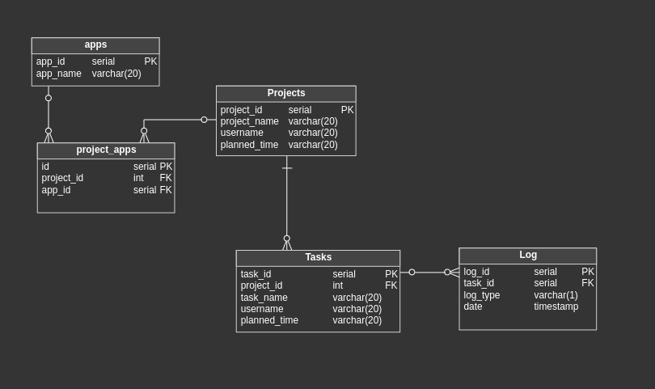

# Workflow
## Description
A project facilitating workflow control from terminal

## Database 

The data is stored in a PostgreSQL database that has a following schema:   

## Allowed order of logs
Only certain orders of logs are possible:
- if task was ended (last log is "E"), no log can be made for this task
- if task was not started (no recent logs), only begin command can be issued (log "B")
- task may be paused if recent log is "B" or "R" (begin or resume)
- task may be resumed only if it was paused (recent log is "P")
- task may be ended in any moment provided it was started

## Available commands
- newproject NAME- creates new project
    OPTIONS:
    -    -t TIME - sets time user plans to spend on project. It should have format DAYS:HOURS:MINUTES
    -    -a APPLIST - sets apps used in the project;

- newtask NAME PROJECT_ID - creates new task in a project of the given id
    OPTIONS:
    -    -t TIME - sets time user plans to spend on task. It should have format DAYS:HOURS:MINUTES;

- tasks - displays all tasks;

- app APPLIST - adds specified apps to db;

- begin ID/NAME - begins the task given by id or name; a task that has ended cannot be started again;

- end ID/NAME - ends the task given by id or name; cannot end a task that was not started;

- pause ID/NAME - pauses the task given by id or name, a task that has already been paused, has ended 
                or has not begun cannot be paused;

- resume ID/NAME - resumes the task given by id or name, a task that has not been paused, has ended 
                    or has not begun cannot be resumed;     

- logs - displays the history of all tasks
    OPTIONS
    -    -t, -tasks TASKIDLIST - displays only the history of the tasks specified in args by id;

- stats - displays stats for every task and project, i.e. number of pauses made during the task,
            time spent working etc.;

- day - displays day stats: a table of projects cdeveloped on the current day
    OPTIONS
        -l - displays additional information for every project developed on the current day and 
            tasks within it
        -d, -date DATE - sets the date to display instead of the current date, DATE should be 
            in format "YYYY-MM-DD"

    (possible merging -ld, -dl options);

- projectapps - displays all apps the projects use;

- projecttasks - displays all tasks belonging to the projects
    OPTIONS
    -    -pr PROJECT_ID_LIST - displays the tasks only for the given projects
    -    -b - displays only the tasks that have been beginned
    -    -nb - displays only the tasks that have not been beginned
    -    -e - displays only the tasks that have been ended
    -    -ne - displays only the tasks that have not been ended;
    
    Returns error if two contraditory filters are applied, i.e. -b and -nb;

- pomodoro PROJECT_ID - enables pomodoro mode for a certain project. The project must be started but not ended.
     When executed, a console with a clock is opened in terminal and one can issue following commands:
    - pause HH:MM:SS - the timer counts down the given time, so as to stop counting, press CTRL + \\.
                        At the end one is asked if a log \"resume\" (back to work) should be added. 
                    Responses are \"yes\" or \"no\"

    - work HH:MM:SS - the timer counts down the given time, so as to stop counting, press CTRL + \\.
                        At the end one is asked if a log \"pause\" (pause work) should be added. 
                    Responses are \"yes\" or \"no\"

    - currenttask - displays stats for the currenttask (with task_id)

    - changetask TASK_ID - changes task for the one with the given id when it exists, is 
                        started and hasn't ended yet

    - clear - clears terminal

    - exit - exits the pomodoro mode

    OPTIONS  
    -  clearing - enables clearing terminal when its overflown;

- man - displays app's manual;